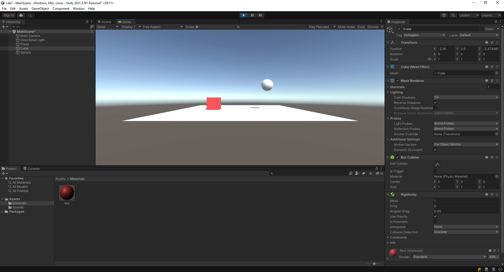

# РАЗРАБОТКА ИГРОВЫХ СЕРВИСОВ
Отчет по лабораторной работе #1 выполнил:
- Заикин Александр Юрьевич
- РИ300012
Отметка о выполнении заданий (заполняется студентом):

| Задание | Выполнение | Баллы |
| ------ | ------ | ------ |
| Задание 1 | * | 60 |
| Задание 2 | * | 20 |
| Задание 3 | * | 20 |

знак "*" - задание выполнено; знак "#" - задание не выполнено;

Работу проверили:
- к.т.н., доцент Денисов Д.В.
- к.э.н., доцент Панов М.А.
- ст. преп., Фадеев В.О.

[](https://nodesource.com/products/nsolid)

[](https://travis-ci.org/joemccann/dillinger)

Структура отчета

- Данные о работе: название работы, фио, группа, выполненные задания.
- Цель работы.
- Задание 1.
- Код реализации выполнения задания. Визуализация результатов выполнения (если применимо).
- Задание 2.
- Код реализации выполнения задания. Визуализация результатов выполнения (если применимо).
- Задание 3.
- Код реализации выполнения задания. Визуализация результатов выполнения (если применимо).
- Выводы.
- ✨Magic ✨

## Цель работы
Ознакомиться с основными функциями Unity и взаимодействием с объектами внутри редактора.

## Задание 1
### В разделе «ход работы» пошагово выполнить каждый пункт с описанием и примером реализации задач по теме видео самостоятельной работы
Ход работы:
1)	Создать новый проект из шаблона 3D – Core;
2)	Проверить, что настроена интеграция редактора Unity и Visual Studio Code (пункты 8-10 введения);
3)	Создать объект Plane;
4)	Создать объект Cube;
5)	Создать объект Sphere;

6)	Установить компонент Sphere Collider для объекта Sphere;
7)	Настроить Sphere Collider в роли триггера;

8)	Объект куб перекрасить в красный цвет;
9)	Добавить кубу симуляцию физики, при это куб не должен проваливаться под Plane;

10) Написать скрипт, который будет выводить в консоль сообщение о том, что объект Sphere столкнулся с объектом Cube;
11) При столкновении Cube должен менять свой цвет на зелёный, а при завершении столкновения обратно на красный.
```cs
public class CheckCollider : MonoBehaviour
{
    private void OnTriggerEnter(Collider other)
    {
        Debug.Log($"Sphere has collided with {other.name}");
        if (other.TryGetComponent<Renderer>(out var renderer))
        {
            renderer.material.SetColor("_Color", Color.green);
        }
    }

    private void OnTriggerExit(Collider other)
    {
        if (other.TryGetComponent<Renderer>(out var renderer))
        {
            renderer.material.SetColor("_Color", Color.red);
        }
    }
}
```


## Задание 2
### Продемонстрируйте на сцене в Unity следующее:
### - Что произойдёт с координатами объекта, если он перестанет быть дочерним?

Сфера - потомок капсулы, двигается вместе с ней. (на самом деле повторяет любое изменение трансформа)


Сфера перестала быть дочерним объектом, теперь она не двигается при движении капсулы.


### - Создайте три различных примера работы компонента RigidBody?


1) Капсула; Режим Kinematic - RigidBody управляется напрямую из пользовательских скриптов. Оно служит препятствием для Dynamic RigidBody.

2) Куб; Режим Dynamic - RigidBody двигается по законам физики, сталкивается с другими объектами, находится под действием гравитации (опционально).

3) Цилиндр; RigidBody находится под действием Constraints по позиции (не может двигатся). В скрипте ему передаётся крутящий момент.

```cs
private void Start()
{
    var rigidbody = GetComponent<Rigidbody>();
    rigidbody.AddRelativeTorque(Vector3.forward * speed);
}
```

## Задание 3
### Реализуйте на сцене генерацию n кубиков. Число n вводится пользователем после старта сцены.


1) Создан пустой объект CubeSpawner и к нему прикреплён компонент:

```cs
public class CubeSpawner : MonoBehaviour
{
    [SerializeField] private TMP_InputField inputField;
    [SerializeField] private GameObject cubePrefab;
    [SerializeField] private float cubeSpawnDistance;

    private void Start()
    {
        inputField.onEndEdit.AddListener((text) =>
        {
            var cubeCount = int.Parse(text);
            for (var i = 0; i < cubeCount; i++)
            {
                Instantiate(cubePrefab, cubeSpawnDistance * i * Vector3.up, new Quaternion());
            }
        });
    }
}
```
2) Создан префаб куба, ему изменён цвет на красный и добавлен компонент RigidBody. Ссылка на него добавлена в CubeSpawner.
3) Созданы объекты Canvas и дочерний InputField. InputField помещён в центр экрана и ссылка на него добавлена в CubeSpawner.

## Выводы

Ознакомился с основными функциями Unity и взаимодействием с объектами внутри редактора. Ознакомился с правилами оформления отчёта.

## Powered by

**BigDigital Team: Denisov | Fadeev | Panov**
